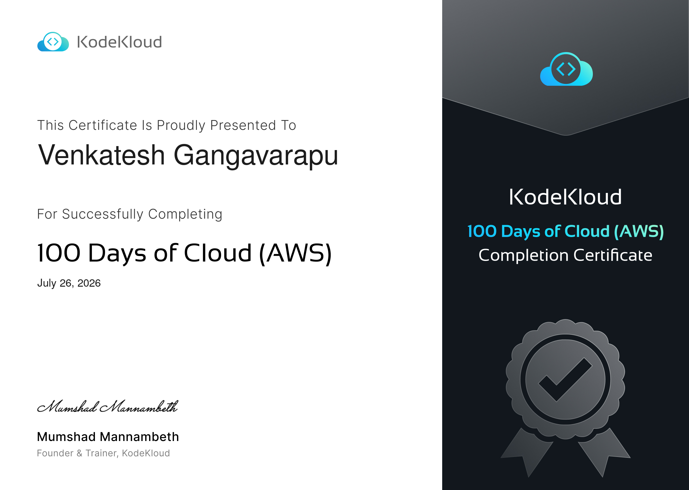

# ☁️ 100 Days of Cloud — AWS Challenge

> **Publicly documenting 100 days of hands-on AWS learning — one concept, one lab, one post at a time.**

[](/)
[](https://engineer.kodekloud.com/signup?referral=64ad88f5803455eea0a89ad5)
[](https://www.linkedin.com/in/venkatesh-gangavarapu)

---

## 🎯 Why I'm Doing This

Cloud infrastructure isn't something you learn by reading — you learn it by breaking things and fixing them. This challenge is my commitment to 100 consecutive days of hands-on AWS work: real labs, real commands, real mistakes documented publicly.

The goal isn't perfection. It's consistency, depth, and building a track record that speaks for itself.

---

## 🗺️ Challenge Roadmap

| Phase | Days | Focus Area | Status |
|-------|------|------------|--------|
| **Phase 1** | 1 – 10 | AWS Foundations (IAM, EC2, VPC, S3, CLI) | ✅ Complete  |
| **Phase 2** | 11 – 20 | Storage, Databases & Networking (RDS, EFS, ELB, Route 53) | ✅ Complete  |
| **Phase 3** | 21 – 30 | High Availability & Scaling (Auto Scaling, CloudFront, SQS, SNS) | ✅ Complete  |
| **Phase 4** | 31 – 40 | DevOps on AWS (CodePipeline, ECS, EKS, CloudFormation, Terraform) | ✅ Complete  |
| **Phase 5** | 41 – 50 | Security, Monitoring & Cost Optimization (CloudTrail, GuardDuty, Cost Explorer) | ✅ Complete  |

---

## 📅 Daily Log

| Day | Topic | Key Concepts | Status |
|-----|-------|-------------|--------|
| [Day 01](./days/day-01/README.md) | Creating an AWS EC2 Key Pair | Key pair types, .pem permissions, CLI creation, SSH access | ✅ Done |
| [Day 02](./days/day-02/README.md) | Creating an AWS Security Group | Stateful firewall, inbound/outbound rules, SG-as-source, tiered access model | ✅ Done |
| [Day 03](./days/day-03/README.md) | Creating a Subnet in AWS VPC | Public vs private subnets, CIDR planning, route tables, IGW, multi-AZ design | ✅ Done |
| [Day 04](./days/day-04/README.md) | S3 Bucket Versioning | Versioning states, delete markers, version recovery, lifecycle policy pairing | ✅ Done |
| [Day 05](./days/day-05/README.md) | Creating an AWS EBS Volume | gp3 vs gp2, AZ scoping, attach/format/mount lifecycle, snapshots, DLM | ✅ Done |
| [Day 06](./days/day-06/README.md) | Launching an EC2 Instance | AMI resolution, instance types, CPU credits, stop vs terminate, IMDS, user data | ✅ Done |
| [Day 07](./days/day-07/README.md) | Changing EC2 Instance Type | Stop/modify/start lifecycle, status checks, CPU credits, right-sizing strategy | ✅ Done |
| [Day 08](./days/day-08/README.md) | EC2 Stop Protection | DisableApiStop vs DisableApiTermination, limits of protection, IAM controls, audit | ✅ Done |
| [Day 09](./days/day-09/README.md) | EC2 Termination Protection | DisableApiTermination, stop vs terminate distinction, ASG impact, Delete on Termination, audit | ✅ Done |
| [Day 10](./days/day-10/README.md) | Attaching an Elastic IP to EC2 | EIP vs dynamic IP, Allocation vs Association ID, disassociate vs release, failover pattern | ✅ Done |
| [Day 11](./days/day-11/README.md) | Attaching an ENI to EC2 | Primary vs secondary ENIs, AZ constraint, device index, MAC failover, OS config | ✅ Done |
| [Day 12](./days/day-12/README.md) | Attaching an EBS Volume to EC2 | NVMe device naming, AZ constraint, format/mount/fstab lifecycle, nofail, Delete on Termination | ✅ Done |
| [Day 13](./days/day-13/README.md) | Creating an AMI from an EC2 Instance | AMI vs snapshot, no-reboot flag, available state, deregister + cleanup, golden AMI pipeline | ✅ Done |
| [Day 14](./days/day-14/README.md) | Terminating an EC2 Instance | Stop vs terminate, DeleteOnTermination, EIP cleanup, pre-termination checklist, Spot interruptions | ✅ Done |
| [Day 15](./days/day-15/README.md) | Creating an EBS Snapshot | Incremental model, pending vs completed, DLM vs AWS Backup, restore workflow, cross-region copy | ✅ Done |
| [Day 16](./days/day-16/README.md) | Creating an IAM User | IAM user vs role vs group, least privilege, MFA enforcement, credential report, IAM Identity Center | ✅ Done |
| [Day 17](./days/day-17/README.md) | Creating an IAM Group | Groups vs direct attachment, additive permissions, no nesting, group-as-principal limitation, delete order | ✅ Done |
| [Day 18](./days/day-18/README.md) | Creating an IAM Policy | Policy JSON anatomy, ec2:Describe*, evaluation logic, Policy Simulator, permission boundaries | ✅ Done |
| [Day 19](./days/day-19/README.md) | Attaching IAM Policy to IAM User | attach vs put-user-policy, ARN resolution, list-entities-for-policy, 10-policy limit, simulation | ✅ Done |
| [Day 20](./days/day-20/README.md) | Creating an IAM Role for EC2 | Trust policy vs permission policy, Instance Profile, IMDS credential flow, STS AssumeRole | ✅ Done |
| [Day 21](./days/day-21/README.md) | Launch EC2 + Associate Elastic IP | End-to-end compound workflow, Ubuntu AMI resolution, wait synchronisation, EIP lifecycle | ✅ Done |
| [Day 22](./days/day-22/README.md) | SSH Key Injection via EC2 User Data | cloud-init, authorized_keys permissions, PermitRootLogin, StrictHostKeyChecking, SSM alternative | ✅ Done |
| [Day 23](./days/day-23/README.md) | S3 Data Migration: Create Bucket + Sync | s3 sync vs cp, us-east-1 bucket quirk, Block Public Access, dryrun verification, cross-account pattern | ✅ Done |
| [Day 24](./days/day-24/README.md) | Application Load Balancer Setup | ALB + TG + listener wiring, layered SG model, health checks, multi-AZ requirement, HTTPS path | ✅ Done |
| [Day 25](./days/day-25/README.md) | EC2 + CloudWatch CPU Alarm + SNS | Period vs EvaluationPeriods, INSUFFICIENT_DATA, treat-missing-data, set-alarm-state testing | ✅ Done |
| [Day 26](./days/day-26/README.md) | EC2 Web Server: Nginx via User Data | apt-get update requirement, start vs enable, timing buffer, diagnostic chain, custom AMI vs User Data | ✅ Done |
| [Day 27](./days/day-27/README.md) | Custom Public VPC + Subnet + EC2 | 5-component public subnet stack, route table association, auto-assign IP, DNS hostnames, cleanup order | ✅ Done |
| [Day 28](./days/day-28/README.md) | ECR: Create Repo, Build Image, Push | ECR auth flow, URI format, tag mutability, lifecycle policies, image scanning, CI/CD integration | ✅ Done |
| [Day 29](./days/day-29/README.md) | VPC Peering: Default ↔ Private VPC | 5-step setup, dual route table updates, ICMP SG rule, non-transitive routing, TGW comparison | ✅ Done |
| [Day 30](./days/day-30/README.md) | NAT Instance for Private Subnet | Source/dest check, iptables MASQUERADE, AL2023 iptables install, IP forwarding, NAT vs NAT GW | ✅ Done |
| [Day 31](./days/day-31/README.md) | Private RDS MySQL Instance | Free tier, storage autoscaling, private access, Multi-AZ vs replicas, RDS Proxy, PITR | ✅ Done |
| [Day 32](./days/day-32/README.md) | RDS Snapshot and Restore | Manual vs automated backups, snapshot states, PITR, cross-account sharing, pre-upgrade validation pattern | ✅ Done |
| [Day 33](./days/day-33/README.md) | AWS Lambda: Serverless Function | Cold starts, execution role, json.dumps body, concurrency, layers, versioning, X-Ray | ✅ Done |
| [Day 34](./days/day-34/README.md) | Lambda from Zip Package via CLI | zip structure/root path, fileb:// vs file://, idempotent role check, update-function-code, S3 deploy | ✅ Done |
| [Day 35](./days/day-35/README.md) | Private RDS + PHP App Connectivity | SG-as-source for DB tier, initial db-name, mysqli extension, SSH key injection, debug ordering | ✅ Done |
| [Day 36](./days/day-36/README.md) | EC2 + Nginx Behind ALB (default SG reuse) | Default SG no internet rule by default, SG-as-source swap exercise, default-SG anti-pattern | ✅ Done |
| [Day 37](./days/day-37/README.md) | EC2 IAM Role for S3 Access | Instance profile vs role (CLI gotcha), dual resource ARNs, IMDS credential delivery, least privilege | ✅ Done |
| [Day 38](./days/day-38/README.md) | ECR + ECS Fargate Deployment | Task vs service, execution role vs task role, awsvpc networking, assignPublicIp, valid CPU/memory combos | ✅ Done |
| [Day 39](./days/day-39/README.md) | S3 Static Website Hosting | BPA before policy, website vs API endpoint, bucket/* for GetObject, HTTP-only limitation, CloudFront path | ✅ Done |
| [Day 40](./days/day-40/README.md) | Troubleshooting: VPC Internet Connectivity | IGW/route table/public IP layered diagnosis, stateless NACL trap, Reachability Analyzer | ✅ Done |
| [Day 41](./days/day-41/README.md) | AWS KMS: Encrypt and Decrypt | Base64 ciphertext decode to binary, fileb:// vs file://, 4KB limit, envelope encryption, key deletion waiting period | ✅ Done |
| [Day 42](./days/day-42/README.md) | DynamoDB: Table, Items, and Verification | DynamoDB JSON format, schemaless design, get-item vs scan, on-demand billing, GSI access patterns | ✅ Done |
| [Day 43](./days/day-43/README.md) | Amazon EKS: Private Cluster Provisioning | eksClusterRole trust policy, private vs public endpoint, Auto Mode, IRSA, cluster vs node IAM roles | ✅ Done |
| [Day 44](./days/day-44/README.md) | ASG + ALB + Nginx HA Stack | AL2 yum vs AL2023 dnf, ELB health checks, grace period, target tracking, connection draining | ✅ Done |
| [Day 45](./days/day-45/README.md) | NAT Gateway: Private Subnet Internet Access | NAT GW in public subnet rule, NAT GW vs NAT Instance, S3 Gateway Endpoint alternative, multi-AZ NAT HA | ✅ Done |
| [Day 46](./days/day-46/README.md) | Lambda S3 Copy Trigger + DynamoDB Logging | Event trigger chain, confused deputy, handler string, IAM propagation, DLQ pattern | ✅ Done |
| [Day 47](./days/day-47/README.md) | CloudFormation: Priority Queuing (SQS + SNS + Lambda) | CAPABILITY_NAMED_IAM, SNS filter policies, SQS queue policy, iam:PutRolePolicy vs iam:AttachRolePolicy, env var case sensitivity, pull vs push Lambda | ✅ Done |
| [Day 48](./days/day-48/README.md) | CloudFormation: Lambda Function Deployment | ZipFile index.lambda_handler rule, ManagedPolicyArns vs inline Policies, AWSLambdaBasicExecutionRole | ✅ Done |
| [Day 49](./days/day-49/README.md) | Multi-VPC Log Aggregation (VPC Peering + S3) | Both RT updates required, ProxyJump SCP bug, no placeholder uploads, /usr/bin/ in cron, real file content validation | ✅ Done |
| [Day 50](./days/day-50/README.md) | EBS Volume Expansion (Live Resize) | modify-volume + growpart + resize2fs/xfs_growfs, optimizing vs completed state, three-layer model | ✅ Done |

---

## 🧰 Lab Environment & Tools

| Tool | Purpose |
|------|---------|
| **AWS Free Tier Account** | Primary cloud environment |
| **AWS CLI v2** | Command-line access and automation |
| **KodeKloud** | Guided labs and challenge platform |
| **Terraform** | Infrastructure as Code (Phase 4+) |
| **VS Code** | Local development and scripting |
| **GitHub** | Version control and public portfolio |

---

## 📂 Repository Structure

```
100-days-cloud-aws/
├── README.md               ← This file (portfolio tracker)
├── day-01/
│   ├── README.md           ← Concepts, steps, commands reference, real-world context
│   └── commands.sh         ← All commands used that day
├── day-02/
│   ├── README.md
│   └── commands.sh
└── ...
```

---

## 🔗 Connect

- 💼 [LinkedIn](https://www.linkedin.com/in/venkatesh-gangavarapu) — daily posts throughout the challenge
- 🐙 [GitHub](https://github.com/venkatesh-gangavarapu/100-days-cloud-challenge-AWS) — all code and documentation

---
🏆 Challenge Complete — Certificate Earned



*Started: April 2026 | Target Completion: July 2026*

---

## 🏆 Challenge Completed

| | |
|--|--|
| **Status** | ✅ Complete |
| **Days completed** | 50 / 50 |
| **Certificate** | [Certificate](https://engineer.kodekloud.com/certificate-verification/51926466-adb1-4191-b2e3-ab78265cf5b6) |
| **Duration** | 50 consecutive days |

### AWS Services Covered Across 50 Days

| Category | Services |
|----------|---------|
| **Compute** | EC2, AMI, EBS, EIP, ENI, ASG, Launch Templates |
| **Containers** | ECR, ECS Fargate, EKS |
| **Networking** | VPC, Subnets, IGW, NAT Gateway, NAT Instance, VPC Peering, ALB, Security Groups, Route Tables |
| **Storage** | S3 (versioning, static website, migration, events), EBS (snapshots, live resize) |
| **Database** | RDS MySQL (private, snapshots, restore), DynamoDB |
| **Serverless** | Lambda, API Gateway integration |
| **Security & IAM** | IAM Users, Groups, Policies, Roles, KMS, Instance Profiles |
| **Monitoring** | CloudWatch Alarms, SNS |
| **Infrastructure as Code** | CloudFormation (SQS + SNS + Lambda, Lambda inline, custom resources) |
| **Messaging** | SQS (priority queuing), SNS (filter policies, subscriptions) |

### Per-Day Deliverables (Every Day)

Each of the 50 days produced:
- **`README.md`** — Console walkthrough (Method 1) + full CLI script (Method 2) + common mistakes + real-world context + interview Q&A
- **`commands.sh`** — Standalone executable command reference
- **`linkedin_post.txt`** — Daily LinkedIn post (published each day)

### Real Failures Documented

This challenge documents what actually happened — not just the happy path:
- 502 Bad Gateway from Nginx not installed (Day 44) — User Data ran `dnf` on Amazon Linux 2 which uses `yum`
- `iam:PutRolePolicy` blocked mid-CloudFormation deploy (Days 47–48) — switched to `ManagedPolicyArns`
- ProxyJump SCP auth failure (Day 49) — `-i KEY_FILE` only applies to destination, not jump host
- Validator rejected placeholder S3 content (Day 49) — must upload actual log file, not test strings
- VPC peering route missing on public RT (Day 49) — both route tables must be updated explicitly
